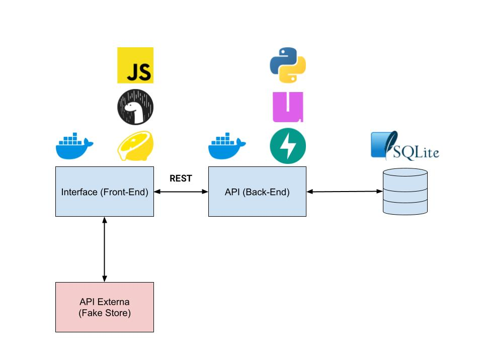

# pucpos-arquitetura-f
Front-End for **Fresh Store**, which uses [Fake Store API](https://fakestoreapi.com/) and our own [Back-End API](https://github.com/thiagola92/pucpos-arquitetura-b) to show products and let the user write reviews.



This project uses [Deno](https://deno.com/) as runtime for JavaScript/TypeScript and [Fresh](https://fresh.deno.dev/) as framework.

# Usage

Make sure to install Deno:
https://docs.deno.com/runtime/getting_started/installation

Install dependencies:

```
deno install
```

Then start the project in development mode:

```
deno task dev
```

This will watch the project directory and restart as necessary.

Access through http://localhost:5173

# Container

```shell
# Create network (if doesn't exist)
sudo docker network create --driver bridge pucpos

# Build image
sudo docker image build --tag "pucpos-f" .

# Create container
sudo docker container create --network pucpos --publish 5173:5173 --name "pucpos-f" pucpos-f

# Start container
sudo docker container start --attach pucpos-f
```

```shell
# Remove container, image and network
sudo docker container stop pucpos-f
sudo docker container rm pucpos-f
sudo docker image rm pucpos-f
sudo docker network rm pucpos
```

# References

- https://fresh.deno.dev/
- https://fakestoreapi.com/
- https://developer.mozilla.org/en-US/docs/Web/HTML/Reference/Elements
- https://picocss.com/
- https://developer.mozilla.org/en-US/docs/Learn_web_development/Core/Scripting/Events#inline_event_handlers_%E2%80%94_dont_use_these
- https://developer.mozilla.org/en-US/docs/Web/Accessibility/ARIA/Reference/Roles
